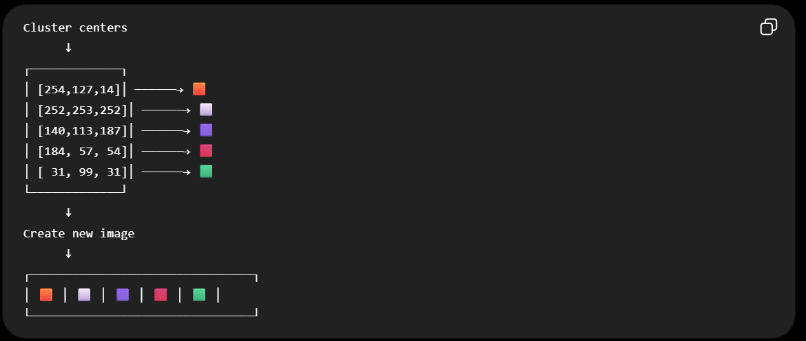
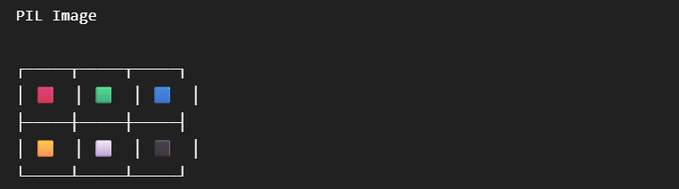
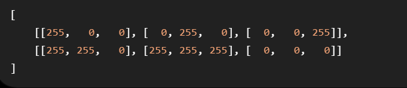

We are using the cluster centers to create a new image (a color palette).



1. Why do we convert `PIL Image` -> Numpy array?
```image = Image.open(uploaded_file).convert("RGB")```

At this point, image is a PIL Image object 
`type(image)` # PIL.Image.Image, It contains the picture and provides image-oriented operations.

But, K-Means expects numerical data, essentially a NumPy array. So, we use `image = np.array(image)`

Suppose your image is only `2 X 3` pixels:


After : `image = np.array(image)`
